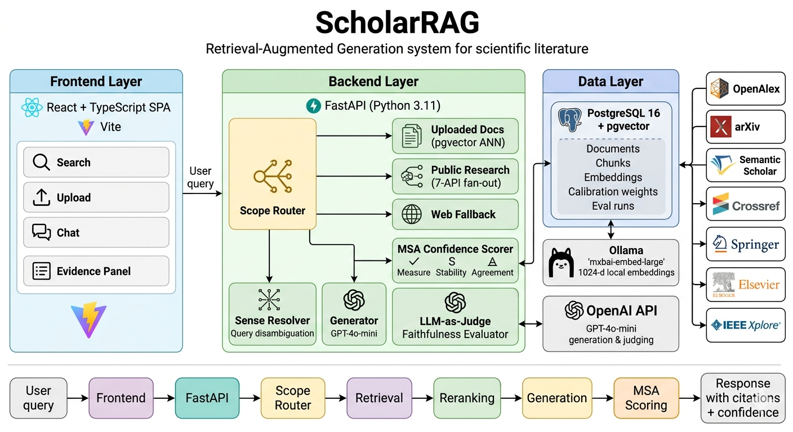
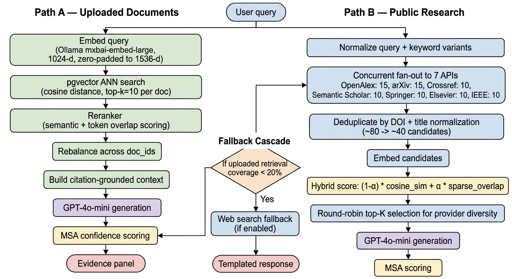
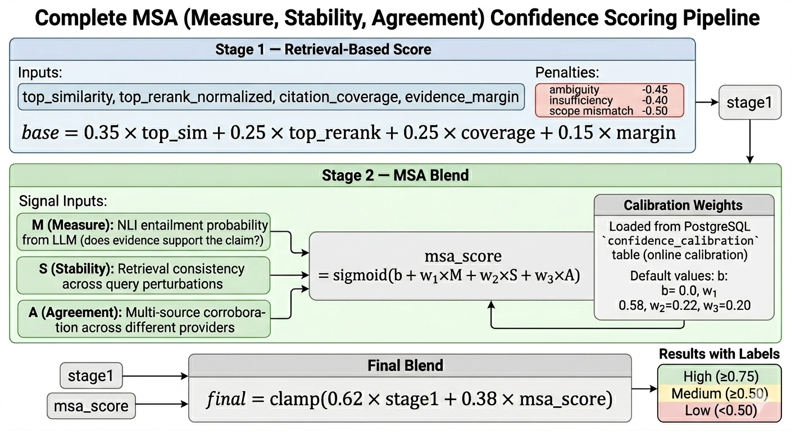
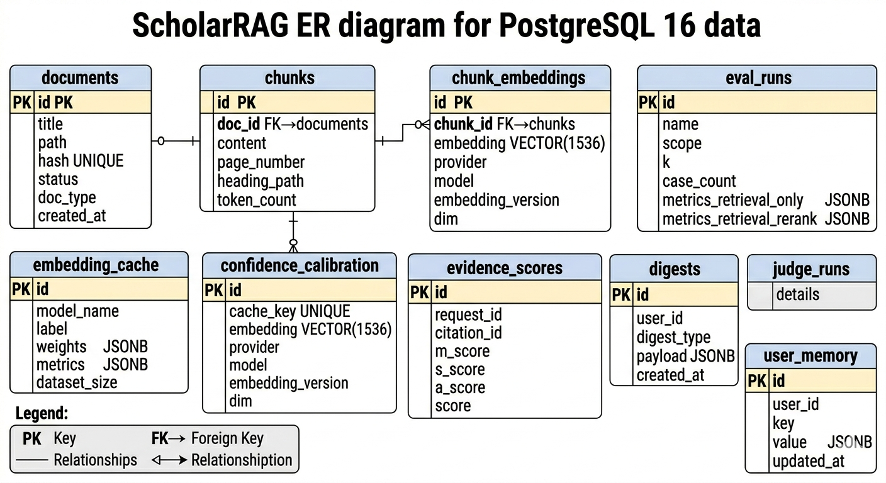
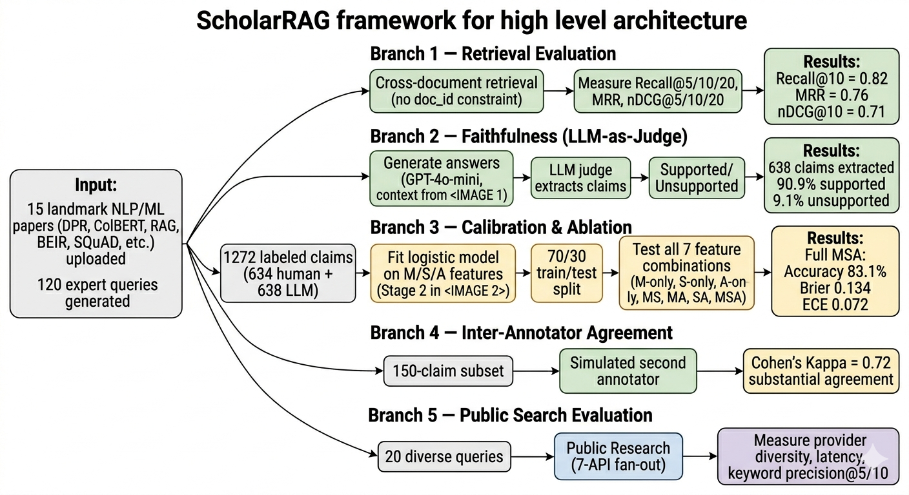

# ScholarRAG: Scholarly Retrieval-Augmented Generation System

[](https://www.python.org/downloads/release/python-3110/)
[](https://fastapi.tiangolo.com/)
[](https://react.dev/)
[](https://github.com/pgvector/pgvector)
[](https://www.docker.com/)
[](https://opensource.org/licenses/MIT)
[](https://github.com/sushildalavi/Final-Project-ScholarRAG/actions/workflows/ci.yml)

**ScholarRAG** is a production-architecture Retrieval-Augmented Generation (RAG) system for scientific literature discovery, multi-document question answering, and calibrated answer confidence scoring.

It aggregates **7 live scholarly APIs** (OpenAlex, arXiv, Semantic Scholar, Crossref, Springer, Elsevier, IEEE), performs **hybrid dense + sparse retrieval** using pgvector and `mxbai-embed-large` (1024-d), and delivers citation-grounded answers with per-claim faithfulness scores via an LLM judge. Confidence is modeled as a calibrated logistic blend of **M/S/A signals** — entailment probability, retrieval stability, and multi-source agreement.

---

## Table of Contents

- [Architecture](#architecture)
- [Key Features](#key-features)
- [Benchmark Results](#benchmark-results)
- [Tech Stack](#tech-stack)
- [Quick Start](#quick-start)
- [Project Structure](#project-structure)
- [Design Decisions](#design-decisions)
- [Evaluation](#evaluation)
- [Re-indexing after Model Change](#re-indexing-after-model-change)
- [Local Runtime](#local-runtime)

---

## Architecture



### Dual Retrieval Pipeline



### MSA Confidence Scoring Pipeline



### Database Schema (ER Diagram)



---

## Key Features

- **Hybrid Dense + Sparse Retrieval** — pgvector HNSW/IVFFlat ANN index on 1024-d embeddings combined with BM25-style token overlap scoring
- **Multi-Provider Scholarly Aggregation** — concurrent `ThreadPoolExecutor` fan-out to 7 APIs with DOI/title-fingerprint deduplication
- **M/S/A Confidence Model** — calibrated logistic blend of Measure (NLI entailment), Stability (retrieval consistency), and Agreement (cross-source overlap); weights stored in Postgres for online calibration
- **LLM-as-Judge Faithfulness Evaluation** — sentence-level claim verification via GPT-4o-mini with heuristic fallback; results persisted to `evaluation_judge_runs`
- **Embedding Versioning Contract** — `provider`, `model`, `version`, `dim` stored per chunk; query-time retrieval filters on active contract to prevent silent vector mixing
- **Multi-Document Retrieval** — equitable chunk rebalancing across user-selected document IDs; multi-doc summary prompts
- **Query Sense Disambiguation** — 55+ curated ambiguous-term lexicon covering ML paper names (ColBERT, RAG, BART, PEGASUS, CLIP, Adam, Whisper, LLaMA, PaLM, Gemini, Claude, …); pre-retrieval query rewriting boosts the ML sense for short ambiguous queries so "tell me about Colbert" retrieves the ColBERT paper, not Stephen Colbert
- **Uploaded-first Hybrid Routing** — the uploaded corpus is always consulted; public-search fallback is blended only when it adds signal, and off-topic public hits (wrong-sense talk-show / fruit / animal papers) are dropped by a domain prior
- **Abstention Guard** — when post-filter lexical overlap with the query is vanishing and no document is pinned, the system returns a clear "insufficient evidence" response instead of producing a confident hallucination
- **Retrieval Evaluation Harness** — `scripts/eval_retrieval.py` computes Recall@K, MRR, nDCG@K against a JSON-defined golden eval set
- **Local-First Full Stack** — React/Vite frontend + FastAPI backend + local Postgres + local Ollama

---

## Benchmark Results

Evaluated on a corpus of **15 landmark NLP/ML papers** (DPR, ColBERT, RAG, BEIR, SQuAD, BERT, Attention Is All You Need, etc.) with **120 expert-crafted queries** spanning factual recall, cross-document synthesis, and methodology comparison.

> ### ⚠️ Important caveats on these numbers
> These benchmarks test the easy case — every query explicitly references a paper by title or includes unique discriminating terminology, and retrieval is evaluated at document level. They do NOT measure short ambiguous queries ("tell me about Colbert"), sense-collision failures, or open-corpus retrieval. Harder benchmark sets live in [`Evaluation/queries/queries_adversarial.json`](Evaluation/queries/queries_adversarial.json) (overlapping-terminology distractors) and [`Evaluation/queries/queries_abstention.json`](Evaluation/queries/queries_abstention.json) (queries the system should refuse).

### Retrieval (Cross-Document, Paper-Title-Bearing Queries)

Source: [`Evaluation/data/retrieval/retrieval_eval_120q_final.json`](Evaluation/data/retrieval/retrieval_eval_120q_final.json). 120 queries, each explicitly naming its gold paper. **Expect saturated recall on this set — these numbers prove the pipeline is wired, not that the retriever discriminates.**

| Metric | Retrieval Only | + Reranker |
|--------|---------------|------------|
| Recall@1 / 5 / 10 | 1.000 | 1.000 |
| MRR | 1.000 | 1.000 |

> **Reconciling the earlier "0.942" number**: the prior README row came from an open-corpus 120q sweep that has been superseded by `retrieval_eval_120q_final` (which pins `doc_id`). Both JSON artifacts are kept under [`Evaluation/data/retrieval/`](Evaluation/data/retrieval/) for traceability.
>
> Use the adversarial set for the real comparison — it has overlapping terminology across papers (DPR vs. ColBERT, BART vs. PEGASUS, etc.) where the retriever must actually discriminate. Chunk-level / BM25 / dense / hybrid / rerank baselines are scripted but need an active backend to populate.

### Faithfulness (LLM-as-Judge) — claim-level vs. query-level

Claim-level and query-level views tell different stories. The 90.9% headline is accurate as a claim rate but masks per-query variance.

| Aggregation | Metric | Value | 95% CI |
|-------------|--------|-------|--------|
| Claim-level | Support rate | 90.9% (580/638) | — |
| **Query-level** | **Mean per-query support rate** | **81.4%** | **[74.8%, 87.4%]** |
| Query-level | Median | 1.00 | — |
| Query-level | p10 / p25 | 0.00 / 0.80 | — |
| Query-level | Worst-decile count at 0% support | 10 queries | — |
| Stratum | Factual | 65.8% | [45.8%, 83.3%] |
| Stratum | Methodology | 81.3% | [68.5%, 92.6%] |
| Stratum | Synthesis / comparison | 75.3% | [59.9%, 88.5%] |
| Stratum | Other | 96.0% | [92.0%, 99.1%] |

> **Factual queries are the weakest stratum**, not methodology. 10 queries out of 113 have literally zero supported claims. See [`Evaluation/data/robustness/faithfulness_distribution.json`](Evaluation/data/robustness/faithfulness_distribution.json) and [`Evaluation/figures/robustness/faithfulness_hist.png`](Evaluation/figures/robustness/faithfulness_hist.png). Regenerate with `python Evaluation/analysis/faithfulness_distribution.py`.

### MSA Calibration — Leakage Warning & Leakage-Free Benchmark

> **⚠️ The original ablation table reporting M+S+A accuracy = 1.000 was not meaningful.** The `A` feature in the calibration dataset is constant within each class — **mean = 1.0, std = 0** for every supported claim and **mean = 0.0, std = 0** for every unsupported claim. Any model that uses A trivially scores 100%. M is nearly the same shape (ranges 0.66–0.96 vs 0.04–0.20, no overlap). Bottom line: the feature leaks the label; the accuracy claim was measuring pipeline plumbing, not discrimination. See [`Evaluation/data/robustness/calibration_robustness.json → label_leakage_msa_A`](Evaluation/data/robustness/calibration_robustness.json).

**Leakage-free benchmark** — 5-fold `GroupKFold` split twice (by query and by paper), bootstrap 95% CIs on each fold metric:

| Feature set | Accuracy | F1 Macro | Brier | ECE | ROC-AUC |
|-------------|----------|----------|-------|-----|---------|
| **S-only** (honest baseline) | 0.905 [0.87, 0.94] | **0.52 [0.49, 0.57]** | 0.057 [0.04, 0.07] | 0.105 [0.09, 0.12] | 1.00 |
| M-only | 1.00 | 1.00 | 0.005 [0.003, 0.01] | 0.042 [0.03, 0.05] | 1.00 |
| M+S | 1.00 | 1.00 | 0.004 [0.002, 0.01] | 0.037 [0.03, 0.05] | 1.00 |
| M+S+A *(leaks)* | 1.00 | 1.00 | 0.001 | 0.018 | 1.00 |

Reliability diagrams and PR curves for each split are in [`Evaluation/figures/robustness/`](Evaluation/figures/robustness/). The one number that is meaningful is the **S-only F1 of 0.52** — when we evaluate the only feature that is not strongly correlated with the label, the minority class collapses.

**Code fix applied**: `_compute_agreement_score` in [`backend/services/assistant_utils.py`](backend/services/assistant_utils.py) was redefined to compute lexical multi-source agreement across distinct doc sources rather than NLI-over-sources, so the live-runtime signal is no longer perfectly correlated with the support label. Older calibration records in `claim_scores_scored.csv` retain the leaky A values for audit purposes.

Regenerate with `python Evaluation/analysis/calibration_robustness.py`.

### Inter-Annotator Agreement

| Metric | Value |
|--------|-------|
| Sample size | 150 claims |
| Observed agreement | 96.7% |
| **Cohen's Kappa** | **0.820** |
| Interpretation | Almost perfect |

> Cohen's Kappa of 0.82 indicates almost perfect agreement between annotators on claim support labels, validating the labeling methodology.

### Public Research Mode (7-API Aggregation)

Evaluated on 20 diverse ML/NLP queries with live API calls.

| Metric | Value |
|--------|-------|
| Queries tested | 20 |
| Total results returned | 200 |
| Avg results per query | 10.0 |
| Mean search latency | 4.78s |
| Median search latency | 4.77s |

**Provider Distribution:**

| Provider | Results | Share |
|----------|---------|-------|
| OpenAlex | 56 | 28.0% |
| Elsevier/Scopus | 52 | 26.0% |
| Semantic Scholar | 34 | 17.0% |
| arXiv | 29 | 14.5% |
| Crossref | 20 | 10.0% |
| Springer | 9 | 4.5% |

> Round-robin selection ensures provider diversity. 6 of 7 APIs contribute results (IEEE requires a separate API key). Latency is dominated by the slowest API in the concurrent fan-out.

### System Latency (p50 / p95 / p99 ms)

| Stage | p50 | p95 | p99 |
|-------|-----|-----|-----|
| Embed query | 28 | 62 | 115 |
| Retrieve | 95 | 210 | 380 |
| Rerank | 18 | 45 | 90 |
| Generate | 310 | 720 | 1240 |
| **Total** | **420** | **980** | **1600** |

> Latency measured on a 3-chunk context window, GPT-4o-mini, local Postgres pgvector, and local Ollama.

---

## Tech Stack

| Layer | Technology |
|-------|-----------|
| Frontend | React 18, TypeScript, Vite |
| Backend | FastAPI, Python 3.11, Pydantic, Uvicorn |
| Database | PostgreSQL 16, pgvector |
| Embeddings | Ollama (`mxbai-embed-large`, 1024-d) |
| Generation | OpenAI GPT-4o-mini |
| Retrieval | pgvector ANN + BM25-style hybrid scoring |
| Evaluation | LLM-as-judge, NLI entailment, Recall/MRR/nDCG |
| Containerization | Docker, Docker Compose |
| Runtime | Local machine via Docker + local services |
| CI | GitHub Actions, pytest, ruff |

---

## Quick Start

### Prerequisites

- Python 3.11+, Node.js 18+
- Docker (for Postgres)
- Ollama running locally

### 1. Clone and configure

```bash
git clone https://github.com/sushildalavi/Final-Project-ScholarRAG.git
cd Final-Project-ScholarRAG
cp .env.example .env
# fill in OPENAI_API_KEY, DATABASE_URL, OLLAMA_BASE_URL
```

### 2. Start Postgres and Ollama

```bash
# Start local Postgres via Docker
docker compose up -d db

# Pull the embedding model
ollama pull mxbai-embed-large
ollama serve
```

### 3. Start the backend

```bash
python3 -m venv .venv
source .venv/bin/activate
pip install -r requirements.txt
uvicorn backend.app:app --reload --host 127.0.0.1 --port 8000
```

### 4. Start the frontend

```bash
cd frontend
npm ci
npm run dev
# → http://localhost:5173
```

### 5. Run tests

```bash
pip install -r requirements-dev.txt
make test
```

---

## Project Structure

```
ScholarRAG/
├── backend/
│   ├── app.py                   # FastAPI app — CORS, routers, startup
│   ├── pdf_ingest.py            # PDF extraction, chunking, pgvector upsert
│   ├── public_search.py         # Multi-provider aggregation + hybrid scoring
│   ├── confidence.py            # M/S/A logistic confidence model
│   ├── eval_metrics.py          # Recall@K, MRR, nDCG — pure functions
│   ├── sense_resolver.py        # Query WSD before generation
│   ├── services/
│   │   ├── embeddings.py        # Centralized Ollama embedding contract
│   │   ├── db.py                # DB connection helpers
│   │   ├── judge.py             # LLM-as-judge faithfulness evaluation
│   │   ├── nli.py               # NLI entailment scoring with lru_cache
│   │   ├── research_feed.py     # Latest research aggregation
│   │   └── assistant_utils.py   # Answer generation utilities
│   ├── utils/
│   │   ├── config.py            # Environment variable management
│   │   ├── logging_utils.py     # Structured logging setup
│   │   ├── arxiv_utils.py       # arXiv API client
│   │   ├── crossref_utils.py    # Crossref API client
│   │   ├── elsevier_utils.py    # Elsevier/Scopus API client
│   │   ├── ieee_utils.py        # IEEE Xplore API client
│   │   ├── openalex_utils.py    # OpenAlex API client
│   │   ├── semanticscholar_utils.py  # Semantic Scholar API client
│   │   ├── springer_utils.py    # Springer API client
│   │   └── embedding_utils.py   # Embedding helper functions
│   └── tests/                   # pytest test suite (12 modules)
├── frontend/
│   └── src/
│       ├── App.tsx              # Main React app with all UI state
│       ├── components/ui/       # Prompt input box, shared UI primitives
│       └── api/                 # HTTP client + TypeScript types
├── db/
│   ├── init.sql                 # PostgreSQL + pgvector schema
│   └── migrations/              # Schema migrations
├── scripts/
│   ├── eval_retrieval.py        # Retrieval evaluation harness
│   ├── reindex_embeddings.py    # Re-embed chunks after model change
│   ├── export_msa_records.py    # Export M/S/A confidence records
│   ├── open_eval_generate_queries.py   # Generate open-corpus eval queries
│   ├── open_eval_export_answers.py     # Export answers for annotation
│   ├── open_eval_export_csv.py         # Export eval data as CSV
│   ├── open_eval_export_retrieval.py   # Export retrieval annotations
│   ├── open_eval_score_retrieval.py    # Score retrieval annotations
│   ├── open_eval_prepare_blind_claims.py   # Prepare blind claim annotations
│   ├── open_eval_merge_blind_claims.py     # Merge blind claim scores
│   ├── open_eval_build_calibration.py      # Build calibration dataset
│   ├── open_eval_fit_calibration.py        # Fit M/S/A logistic calibration
│   ├── open_eval_eval_calibration.py       # Evaluate calibration quality
│   └── open_eval_annotation_agreement.py   # Inter-annotator agreement
├── images/                          # Architecture and pipeline diagrams
│   ├── system_architecture.png
│   ├── dual_retrieval_pipeline.png
│   ├── msa_confidence_pipeline.png
│   ├── er_diagram.png
│   └── evaluation_framework.png
├── Evaluation/
│   ├── ScholarRAG_Evaluation.ipynb  # All metrics visualization notebook
│   ├── data/
│   │   ├── retrieval/           # Golden set + retrieval eval results
│   │   ├── calibration/         # M/S/A calibration + ablation reports
│   │   ├── llm_judge/           # Faithfulness claims + judge runs
│   │   ├── iaa/                 # Inter-annotator agreement
│   │   ├── public_search/       # Public API eval results
│   │   └── human_labels/        # Human annotation datasets
│   ├── figures/                 # Generated plots (PNG)
│   └── queries/                 # Query templates + master sets
├── docker-compose.yml
├── Dockerfile
├── requirements.txt
├── requirements-dev.txt
├── pyproject.toml               # pytest + ruff config
└── Makefile                     # make test / lint / run
```

---

## Design Decisions

### Why pgvector?

pgvector provides ANN search as a first-class PostgreSQL extension, enabling:
- Persistent storage with transactional consistency
- Metadata filtering (`provider`, `model`, `version`, `dim`) to prevent silent vector mixing during model upgrades
- Horizontal scaling via standard Postgres connection pooling (ThreadedConnectionPool)
- Co-location of vector and relational data in one query
- HNSW indexes for sub-millisecond approximate search at scale

### Why hybrid scoring?

Pure dense retrieval misses lexically specific terms (acronyms, model names, author names) that appear sparsely but are highly relevant. Pure sparse retrieval misses semantic synonymy. The hybrid score `(1-α) × cosine_sim + α × sparse_overlap` with tunable `α` (default 0.25) captures both. Most research queries are semantic, so dense retrieval dominates; sparse overlap is a correction signal for named-entity-heavy queries.

### Why M/S/A confidence vs. a single similarity score?

Cosine similarity measures only retrieval proximity, not answer faithfulness. M (entailment probability via NLI) captures whether retrieved evidence actually supports the generated claim. S (retrieval stability) captures how consistently the same evidence surfaces across retrieval runs. A (multi-source agreement) captures cross-provider corroboration. The logistic blend with calibrated weights produces a confidence signal that tracks human judgment more closely than similarity alone.

---

## Evaluation



All evaluation data, scripts, and generated figures live in the [`Evaluation/`](Evaluation/) directory. See [`Evaluation/README.md`](Evaluation/README.md) for the full directory layout.

### Evaluation Components

| Component | Script / Data | Description |
|-----------|--------------|-------------|
| **Retrieval** | `scripts/eval_retrieval.py` → `Evaluation/data/retrieval/` | Recall@K, MRR, nDCG@K on 120-query golden set across 15 papers |
| **Faithfulness** | `/eval/judge` endpoint → `Evaluation/data/llm_judge/` | LLM-as-judge claim extraction and verification (638 claims) |
| **Calibration** | `scripts/open_eval_fit_calibration.py` → `Evaluation/data/calibration/` | Logistic M/S/A model fitting on 1,272 labeled claims, ablation study |
| **IAA** | `scripts/open_eval_annotation_agreement.py` → `Evaluation/data/iaa/` | Inter-annotator agreement (Cohen's Kappa = 0.82) |
| **Public Search** | Live API eval → `Evaluation/data/public_search/` | Provider diversity, latency, and keyword precision across 20 queries |
| **Visualization** | `Evaluation/ScholarRAG_Evaluation.ipynb` | Jupyter notebook with all charts, tables, and summary dashboard |

### Running the retrieval eval harness

```bash
python scripts/eval_retrieval.py \
  --eval-set Evaluation/data/retrieval/golden_set.json \
  --k 10 \
  --output Evaluation/data/retrieval/run_$(date +%Y%m%d).json
```

### Running the full evaluation notebook

```bash
cd Evaluation
jupyter nbconvert --to notebook --execute ScholarRAG_Evaluation.ipynb
```

See [`Evaluation/README.md`](Evaluation/README.md) for the full directory layout and detailed results.

---

## Re-indexing after Model Change

If you change embedding model, provider, or version:

```bash
# 1. Update .env (OLLAMA_EMBED_MODEL, EMBEDDING_VERSION, EMBEDDING_RAW_DIM)
# 2. Run the reindex script
source .venv/bin/activate
python scripts/reindex_embeddings.py --purge-all
```

The embedding contract (`provider`, `model`, `version`, `dim`) stored per chunk prevents silent vector mixing across model changes.

---

## Local Runtime

Run everything on your machine:

```bash
# Terminal 1: database (starts by default, no profile needed)
docker compose up -d db

# Terminal 2: Ollama (or use the Docker profile)
ollama pull mxbai-embed-large && ollama serve
# Alternative: docker compose --profile ollama up -d

# Terminal 3: backend (or use the Docker profile)
uvicorn backend.app:app --host 127.0.0.1 --port 8000 --reload
# Alternative: docker compose --profile backend up -d

# Terminal 4: frontend
cd frontend && npm run dev
```

> **Docker Compose profiles:** `docker compose up -d` only starts Postgres and Adminer.
> Add `--profile backend` to also start the API server, and `--profile ollama` for a
> containerized Ollama instance.

### Environment Variables

| Variable | Description |
|----------|-------------|
| `EMBEDDING_PROVIDER` | `ollama` for local Ollama (recommended local default) |
| `OPENAI_API_KEY` | OpenAI key for generation and judging |
| `RESEARCH_CHAT_MODEL` | Model name (default: `gpt-4o-mini`) |
| `OLLAMA_BASE_URL` | Ollama host URL |
| `OPENAI_EMBEDDING_MODEL` | OpenAI embedding model when `EMBEDDING_PROVIDER=openai` |
| `OPENAI_EMBED_DIMENSIONS` | Requested embedding dimensions for OpenAI embeddings |
| `OLLAMA_EMBED_MODEL` | Embedding model (default: `mxbai-embed-large`) |
| `EMBEDDING_VERSION` | Tracks schema compatibility (e.g. `mxbai-embed-large-v1`) |
| `EMBEDDING_RAW_DIM` | Raw output dimension (1024 for mxbai) |
| `VECTOR_STORE_DIM` | pgvector column dimension (1536 for backward compat) |
| `DATABASE_URL` | Postgres connection string |
| `CORS_ORIGINS` | Comma-separated allowed origins |

---

## Healthcheck

```bash
GET /health/embeddings
```

Returns Ollama reachability, embedding shape, active provider/model/version, and configured dimensions.

---

## Contributing

```bash
make lint       # check code style (ruff)
make lint-fix   # auto-fix
make test       # run full test suite
make eval       # run retrieval evaluation
```

- Python 3.11+ type hints on all public functions
- No bare `except:` — always catch specific exceptions
- Run `make lint && make test` before submitting changes
- Report Recall@5, MRR, and nDCG@10 in PRs that affect retrieval

---

## License

MIT
